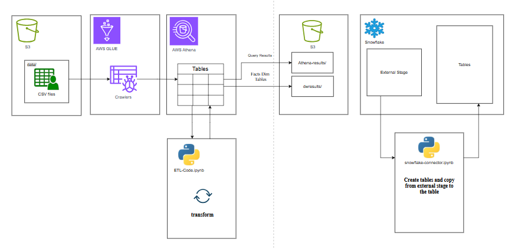
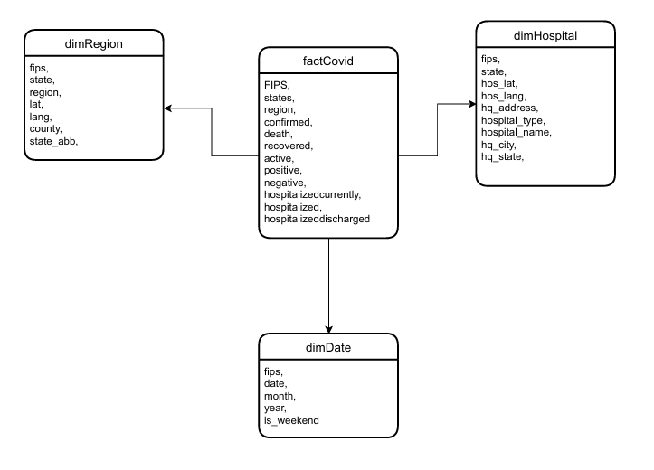

# COVID-19 Data Warehouse (Star Schema) on Snowflake  
**ETL with AWS Athena + Glue → Final Storage & Querying in Snowflake**

A complete end-to-end data warehousing project that ingests raw COVID-19 datasets (Johns Hopkins, NYT, REARC USA Hospital Beds, etc.), transforms them into a clean star schema using AWS Athena, stores the dimension & fact tables in S3, and finally loads them into Snowflake for analytics.

## Project Overview

This project builds a **star schema data warehouse containing:

- **factCovid** – Daily COVID-19 metrics (confirmed, deaths, recovered, active, positive, negative, hospitalizedcurrently, hospitalized, hospitalizeddischarged) at county/state level
- **dimRegion** – Geographic dimension (county, state, province_state, country_region, latitude, longitude, fips)
- **dimHospital** – Hospital details (hospital_name, hospital_type, hq_address, hq_city, hq_state, latitude/longitude, fips)
- **dimDate** – Date dimension (date, year, month, day_of_week, is_weekend)

The factCovid is linked to the three dimensions via **fips** (region/hospital) and **date**.

The entire pipeline is fully automated with two Jupyter notebooks and can be re-run anytime.

## Architecture

```
Raw CSVs (10 files)
       ↓
S3 (data/)
       ↓
AWS Glue Crawlers → Glue Catalog Tables (queryable in Athena)
       ↓
ETL-Code.ipynb → Athena SQL transformations → dim*.csv + factCovid.csv
       ↓
S3 (dwresults/)
       ↓
Snowflake External Stage (@covid_s3_stage) → COPY INTO tables
       ↓
Snowflake Data Warehouse (COVID_DB.COVID_SCHEMA)
```

## Architecture Diagram



## Data Sources (10 Raw Files)

| File / Table Name              | Description                                      | Source                                 |
|-------------------------------|----------------------------------------------------------|----------------------------------------|
| enigma-jhud                   | Johns Hopkins daily reports (global + US counties)       | CSSEGISandData/COVID-19                |
| states_daily                  | NYT US state-level daily data                             | nytimes/covid-19-data                   |
| us_daily                      | US national daily summary                                 | CSSEGISandData                         |
| country                       | Country-level summary                                     | CSSEGISandData                         |
| state                         | State-level metadata                                      | CSSEGISandData                         |
| CountryCode                   | Country codes & names                                     | Various                                |
| CountryPopulation              | Population by country                                     | Various                                |
| statesabv                     | US state abbreviations                                    | Standard                               |
| rearc_usa_hospital_beds       | Definitive Healthcare USA hospital beds dataset            | REARC                                  |
| us_total_latest               | Latest US totals (alternative source)                      | CSSEGISandData                         |

All files were uploaded to `s3://your-bucket/data/` and crawled with AWS Glue to create tables in the Glue Data Catalog.

## Files Structure


## Project Structure

```
.
├── data/                          # Raw CSV files (10 files + 
├── ETL-Code.ipynb 
├── snowflake-connector.ipynb  
├── Images/
├── athena-query_results.csv
└── README.md
```

## Star Schema Diagram




## How to Run (Step-by-Step)

### 1. Upload raw data to S3
Copy the entire `data/` folder to your S3 bucket:
```bash
aws s3 cp data/ s3://your-bucket-name/data/ --recursive
```

### 2. Create Glue Crawlers (one-time)
Create crawlers pointing to each subfolder or to the root `data/` folder so Glue discovers all 10 tables.  
After crawling, tables will appear in Athena.

### 3. Run the ETL (ETL-Code.ipynb)
- Fill in your AWS credentials and bucket details at the top of the notebook.
- Execute all cells → 4 transformed CSVs will be written to `s3://your-bucket-name/dwresults/`

### 4. Set up Snowflake
- Create a database (e.g., `COVID_DB`) and schema (`PUBLIC` or your own).
- Create an external stage pointing to your S3 bucket:
```sql
CREATE OR REPLACE STAGE covid_s3_stage
  URL='s3://your-bucket-name/dwresults/'
  CREDENTIALS=(AWS_KEY_ID='xxx' AWS_SECRET_KEY='xxx');
```

### 5. Load data into Snowflake (snowflake-connection.ipynb)
- Fill in your Snowflake credentials.
- Run the notebook → tables `dimDate`, `dimHospital`, `dimRegion`, `factCovid` are created and loaded.
Final row counts (as of latest run):
- dimDate:      10,187 rows
- dimHospital:   6,637 rows
- dimRegion:  1,017,538 rows
- factCovid:    ~1,092+ rows (depends on date range)

## Query Examples (Snowflake)

```sql
-- Top 10 US states by total deaths
SELECT r.state,
       SUM(f.deaths) AS total_deaths
FROM factCovid f
JOIN dimRegion r ON f.fips = r.fips
GROUP BY r.state
ORDER BY total_deaths DESC
LIMIT 10;

-- Hospitals with most beds near high-case counties
SELECT h.hospital_name, h.hq_city, SUM(f.confirmed) AS cases_nearby
FROM factCovid f
JOIN dimHospital h ON f.fips = h.fips
WHERE f.date = 20210307
GROUP BY h.hospital_name, h.hq_city
ORDER BY cases_nearby DESC;
```

Built with ❤️ using AWS (S3, Glue, Athena) + Snowflake.
Author Affan 
